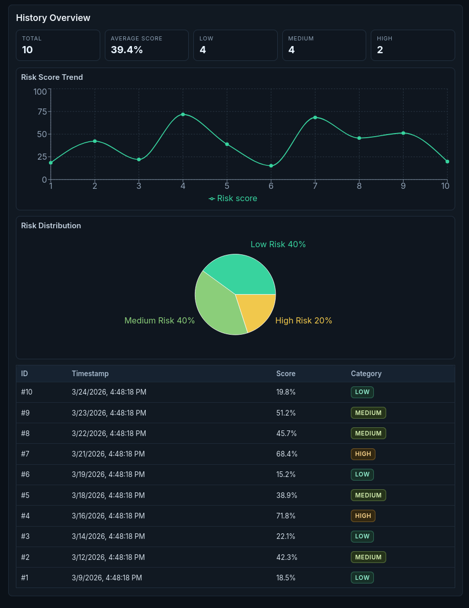

# Cardiovascular Risk Prediction System

## Overview

This project is an end-to-end machine learning system designed to predict cardiovascular disease risk using patient health data. The system goes beyond simple classification by providing:

- Risk prediction (yes/no)
- Risk score (0–100%)
- Risk category (low / medium / high)
- Key contributing factors
- Actionable health recommendations

The goal is to build a **decision-support tool** that demonstrates how machine learning can assist in early detection and prevention of cardiovascular disease.

<p align="center">
  
</p>

---

## 🎯 Objectives

- Train a machine learning model **from scratch** (no pretrained models)
- Use real or synthetic healthcare data
- Perform proper evaluation (accuracy, F1-score, etc.)
- Provide interpretable and actionable outputs
- Deliver a complete, user-facing system (not just a model)

---

## 🧠 Problem Statement

Cardiovascular disease is a leading cause of death worldwide. Early identification of risk factors can help prevent severe outcomes.

This project aims to:
> Predict cardiovascular disease risk using patient data and provide personalized insights.

---

## 📊 Dataset

The dataset includes three types of features:

### 1. Objective (factual)
- Age (days → converted to years)
- Height (cm)
- Weight (kg)
- Gender

### 2. Examination (medical measurements)
- Systolic blood pressure (ap_hi)
- Diastolic blood pressure (ap_lo)
- Cholesterol (1–3)
- Glucose (1–3)

### 3. Subjective (lifestyle)
- Smoking (binary)
- Alcohol intake (binary)
- Physical activity (binary)

### Target:
- `cardio` (0 = no disease, 1 = disease)

---

## ⚙️ Feature Engineering

We derive additional meaningful features:

- **BMI** = weight / (height/100)^2  
- **Pulse Pressure** = systolic - diastolic  
- **Lifestyle Score** = active - smoke - alco  
- Optional:
  - Cholesterol × Glucose interaction
  - Age groups
  - Risk indicators

---

## 🤖 Machine Learning Approach

### Model Types
- Logistic Regression
- Random Forest (primary)
- Optional: SVM or Gradient Boosting

### Tasks
- **Classification** → Predict disease (0/1)
- **Risk Score** → Use model probability (0–100%)

---

## 🧪 Training Pipeline

1. Load dataset
2. Clean data (remove outliers, fix units)
3. Feature engineering
4. Train/test split (80/20)
5. Train model using `.fit()`
6. Generate predictions
7. Evaluate performance

---

## 📈 Evaluation Metrics

- Accuracy
- F1 Score
- Confusion Matrix
- (Optional) ROC Curve

---

## 🧠 Model Outputs

For each user:

- **Prediction:** Disease / No Disease  
- **Risk Score:** e.g., 72.5%  
- **Risk Category:**
  - Low (<30%)
  - Medium (30–70%)
  - High (>70%)
- **Top Factors:**
  - e.g., high BP, cholesterol, age
- **Recommendations:**
  - Increase activity
  - Improve diet
  - Monitor BP

---

## 🖥️ System Architecture

User Input → Backend API → ML Model → Predictions → Dashboard UI


### Components:
- **Model:** Trained in Python (scikit-learn)
- **Backend:** Flask / FastAPI
- **Frontend:** Simple web UI (React or HTML)
- **Storage:** Model saved as `.pkl`

---

## 📊 Dashboard Features

- Risk score gauge (0–100)
- Risk category display
- Feature importance chart
- Health recommendations
- (Optional) trend visualization

---

## 🚫 Constraints (Hackathon Rules)

- ❌ No pretrained models
- ❌ No external APIs
- ❌ No pretrained weights or embeddings
- ✅ Must train model from scratch
- ✅ Must include evaluation metrics
- ✅ Must use a dataset

---

## 🧑‍💻 Team Roles (Suggested)

- **ML Engineer:** Data + model + evaluation
- **Backend Dev:** API + model integration
- **Frontend Dev:** UI + dashboard
- **Product/Presentation:** storytelling + slides

---

## 🚀 Future Improvements

- Time-series risk tracking
- Multi-model ensemble
- Real-time wearable integration
- Personalized intervention simulation

---

## 🏆 Project Value

This project demonstrates:
- Practical ML pipeline
- Healthcare application
- Interpretability and explainability
- Real-world usability

> Not just a model — a complete decision-support system.

---

## 🌐 Minimal Web App (FastAPI + React)

This repo now includes a single-page dark dashboard around the trained model with data visualizations.

### Features
- Single dashboard layout (input, prediction output, and history in one view)
- Dark mode UI with subtle motion and small rounded corners
- Interactive charts (risk score trend and category distribution)
- Real-time risk prediction with inline result panel
- Anonymous prediction logging

### Backend setup/run

From repo root:

```bash
source .venv/bin/activate
pip install -r backend/requirements.txt
uvicorn backend.app.main:app --reload --host 127.0.0.1 --port 8000
```

API endpoints:
- `GET /health`
- `POST /predict`
- `GET /history?limit=20`

Prediction logs are stored locally in `backend/predictions.db` as anonymous records only.

### Frontend setup/run

In a second terminal:

```bash
cd frontend
npm install
npm run dev
```

Open the Vite URL (typically `http://127.0.0.1:5173`) to use the unified dashboard:
- left panel: patient input + run prediction
- right/top panel: latest prediction output
- lower panel: history analytics, charts, and recent predictions table

If your backend runs on a different URL, set:

```bash
VITE_API_BASE=http://127.0.0.1:8000 npm run dev
```

### Technologies Used
- **Backend**: FastAPI, Pydantic, SQLite, scikit-learn
- **Frontend**: React, Vite, Recharts
- **Styling**: Dark dashboard theme with subtle animations
